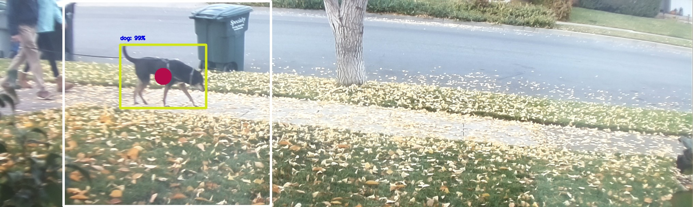
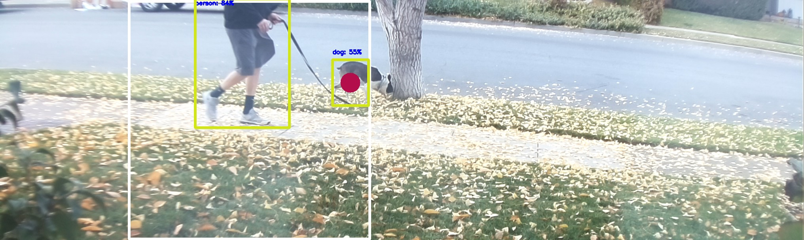
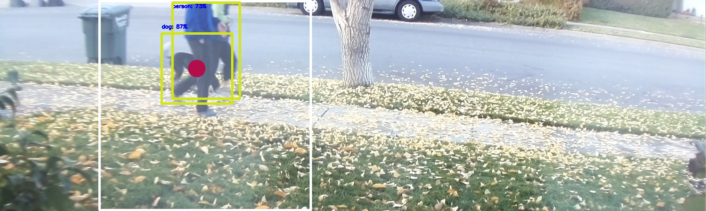

DogDetect - Low Latency Dog Detection for Raspberry Pi4
===================================================================

Motivation
----------
After landscaping we found our front yard had become "the" place for the neighborhood dogs to do their business to the point where
plants were being impacted.  After having marginal success, politely asking the owners to not have their dogs use our yard a solution
requiring dog detection was envisioned.  While the use of a high powered ultrasonic signal ("dog whistle") when a dog was detected was 
the first consideration, we realized we needed to condition the dog owners, not the dogs.  With this in mind the larger system is comprised 
of a dog detection system and a sprinkler controller which can turn on segments of the yard as a deterrent to the owners, as most don't 
want a wet dog when they return home and certainly don't want to get wet themselves.  The corresponding sprinkler controller can be found here:  

[A more interactive description of this project can be found here.](https://thegacway.com/index.php/2020/12/10/sprinklercontroller/)

[SprinklerController - Raspberry Pi Flask Bootstrap 4 implementation](https://github.com/gordonCharles/SprinklerController)

Requirements
------------ 
- Continuous monitoring for dogs with accuracy > 90%
- A precision of > 75%, as false positives are not much of an issue - people will stay dry if they stay on the sidewalk.
- Low computing requirement, Raspberry Pi or similar power consumption
- Text message notification of dog detection
- E-mail notification with labeled detection image
- Sub second latency
- Manual override
- JSON client to message the sprinkler controller
- Robust, must survive power outages and software lock up.  When running the Pi as hard as this application does, the system locks up about every two weeks without a watchdog.
- Remain cool enough to safely operate inside our home
- Silent or near silent operation

Application
------------ 
This provides a dog / cat detection application running an a Raspberry Pi with a [Raspberry Pi High Quality Camera](https://www.raspberrypi.org/products/raspberry-pi-high-quality-camera/), and 
a [Arducam wide angle (6mm) lens](https://www.amazon.com/gp/product/B088GWZPL1/).  This application uses the SSD Mobilnet V2 Single-Shot multibox
Detection (SSD) neural network targeting mobile applications, running on OpenCV.  V3 was available during
development; however, there appeared to be incompatibility between the .pbtxt definitions and OpenCVs
implementation and was not adopted.  The goal of the system is as quickly as possible detect the presence
of a dog in our front yard, typically on or near the sidewalk and send a notification to a separate system
on the same subnet.

SMS notifications (without a SMS service) are generated for free when a dog has been detected and sends an
email with the detection image including the classification regions and their confidence scores.  Targeting a
Pi 4, the system uses threading to both maximize the recognition frame rate and avoid messaging and network
delays from impacting the frame rate.  To maximize the frame rate, a digitally locked loop is implemented
where delays are inserted following processing of a frame (in a thread - called a phase in this implementation) to match
the average delay of the system.  In each phase a captured image runs in its own thread through the object
classification (the single most CPU intensive process), such that multiple images have object classification running in
parallel, the results for a phase are dequeued immediately after kicking off the phase + NUMBER_OF_PHASES-1.
The Pi4 has four cores so there is no value in exceeding four phases.  In addition the neural net is IO
limited, so there is diminishing gains in increasing the number of PHASES beyond 3.  The software is configured
to support arbitrary number of phases, so this can be optimized to different hardware.

The camera's viewport is configured to have a wide aspect ratio, reflecting the visual region of interest.  The neural net
is designed around a 1:1 aspect ratio and is tolerant to some variance in aspect ratio, but demonstrated
significant degradation for an aspect ratio of 10:3.  To maximize accuracy motion detection is applied to the
image and the object recognition is run on a 1:1 portion (IMAGE_HEIGHT x IMAGE_HEIGHT) centered on the motions
centroid.  As configured the system has a frame rate of ~2.1 fps.

When running all four cores are typically in the mid 90s% load, so some form of cooling is needed.  Given
the requirement for near silent operation a passive cooling solution is preferable and the [Geekworm Raspberry Pi 4 Case](https://www.amazon.com/gp/product/B07X5Y81C6/), is 
very effective.  Unfortunately the need for WiFi range in this application WiFi
is important and this case places a large block of Aluminum around the antenna, so the case was modified
to create a cutout in the top side metal around the antennas.  Peak memory usage is around 3GB so
the 4GB of RAM would be sufficient; although, I conservatively chose the 8GB version for this project.  
The application expects a RAM disk @ /var/ramdisk/ to store a cyclical list of captured images.  
This is done to:
1. avoid wear on the SD card - SD card writes have a real impact on the operating life
1. improve the speed performance when needed most

Given the raised operating temperature of the system a night mode has been implemented to lower the
power consumption when the image is too poorly illuminated to be useful.  The digital lock loop slows
down by a factor of ~120 in this mode with the goal of preserving energy and extending the life of the
system (heat has an exponential impact on lifespan in almost everything, electronics included).

This solution is intended to run stand alone indefinitely and uses the OS supplied watchdog driver to interface 
to the Broadcom's watchdog timer. The use of watchdogs in Linux operating systems takes on a different context 
and purpose from embedded systems.  In Linux severs the overriding purpose of the watchdog is to 
prevent bricking of the server itself.  Unfortunately, when the original Desbian watchdog solution was
implemented the authors created a name space collision when they created the daemon which would monitor other 
processes within the system and take responsibility for either petting a HW watchdog or maintaining a SW monitor 
in lieu of one, this software was also named watchdog.  So configurations named WATCHDOG are either for the daemon
or the driver; however, I have yet to find clear documentation that delineates between the two.  Sensibly,
only one SW instance is allowed to connect to the drive at a time, so if the daemon "SW watchdog" is enabled 
other processes are locked out from connecting to the driver.  The watchdog daemon has been designed to monitor 
processes at the process ID resolution, resetting the system of services such as network communication cease to operate.
Verifying operation via process ID is not effective for a multithreaded application, such as this one where 
individual threads within the application need to be monitored.  As a result the hardware watchdog is called 
through the watchdog driver, via an os call.  This implementation does not invoke the watchdog daemon; but, rather 
directly interacts with the watchdog driver.  For this to work the watchdog can not be started at the system level.  This 
application as an alternative owns the watchdog function and monitors critical
thread(s) with the assumption that if the critical infrastructure relative to the application
fails the application will fail with it.  The watchdog implementation is such that the watchdog is not enabled
until the application reads the ENABLE_WATCHDOG parameter from a configuration file.  When it does so it writes
a working configuration file to the RAMDISK to allow remote determination of the configuration state.  The
configuration file provides a safety measure for disabling the watchdog, as deleting or renaming the config
file will disable the watchdog the next time the application is started.  When first running the application it
is recommended to not enable the watchdog.

To start the application following either a loss of power, including a watchdog event, a systemd service is
created.  See instructions in DogDetect_README.txt for installation, enabling and disabling the service.

Repository
---------- 
The repository contains

- The main script, DogDetect2.py
- DogDetect_README.txt - instructions for setting up RAMDISK and systemd based init startup - needed for restarting image following watchdog
- Configuration file for enabling the watchdog, sc_config.txt
- DogDetect.service - the init configuration file for starting DogDetect2.py with systemd
- ssd_mobilenet_v2_coco_2018_03_29.pbtxt - text topology definition of the SSD MobileNet TensorFlow protocol buffer.  OpenCV requires this "map" 
file in addition to the protocol buffer. There are methods to generate this file from the protocol buffer binary; however, I simply downloaded one.
- ssd_mobilenet_v2_frozen_inference_graph.pb - SSD MobileNet TensorFlow protocol buffer binary.  For the curious a [solid explanation of the SSD implementation](https://towardsdatascience.com/review-ssd-single-shot-detector-object-detection-851a94607d11).
- Images - Sample output images from classification

Installation & Development
-------------------------- 
I would strongly encourage the use of a visual debugging suite.  When I started developing on the Pi I ran VNC sessions, with PyCharm running 
locally on the Pi.  On a completely separate project (AI running jobs on AWS servers) I became aware of the power of Microsoft Visual Code.  I 
have never been a fan of Microsoft as they have regularly disappointed with how they have spent their R&D on the office suite, MS Project, and 
Windows; however, Microsoft Visual Code is so well thought out and so well integrated, I've switched all of my project dev environments 
over.  The effectiveness of the remote installations and extensions is truly impressive.  Depending on your local machine setting up an X11 
connection to see the graphical output from the Pi may or may not be straight forward.  To install this on an Linux / macOS / Windows 
platform (assuming you already have python installed): 

1. setup / configure the Pi (you will need the IP address)
1. install the clone / download the repository
1. install the case, carefully feeding the camera's cable through the opening in the top of the case.  The system should be 
able to run without a case; however, the temperature will rise pretty close to the operating limit of the Pi
1. create the RAMDISK (instructions in DogDetect_README.txt)
1. create your private.py definition file - see definitions with import from private in DogDetect2.py
1. modify sc_config.txt to turn the watchdog off `ENABLE_WATCHDOG=0` or move the file from the DogDetect2.py directory
1. run DogDetect2.py.  When not running in service mode, the application will populate a window with the current frame including 
the object detection bounding boxes with confidences and a frame rate.  Running under Microsoft Visual Studio Code, I have 
yet to find the working incantation for displaying these images on the host.  For debugging with image related tasks, the 
best solution I have to date is to run a debugger (PyCharm in my case) natively on the Pi and VNC server.  Editing on 
PyCharm executing on an Pi4 over a VNC connection is manageable, but slow enough you will wish it was faster.  I would 
hesitate to run PyCharm on a slower Pi.

I have built working systems with both the OpenCV implementation and TensorFlow in the Pi and find the OpenCV implementation 
more straightforward.  I've written my own models in both TensorFlow and Pytorch and find Pytorch easier to work with even 
if it lacks some of the capabilities of TensorFlow, so perhaps there's just something about TensorFlow which doesn't fit 
my personal preference.  

Results
-------- 
Overall, I'm satisfied with the detection algorithms performance as it meets the original design criteria.  Moreover, the 
system is meeting the desired objective; having, nearly eliminated dogs doing their business in our yard.  The dog owners 
are apparently very trainable.  I've included three screen shots below.  The white boxes are the portion of the image the
motion detector has determined should be run through the detection algorithm.  The first image is a pretty easy win for
the detector, the second image shows how the motion detector can make the job harder, but still works and the last image 
is pretty impressive in how the detector determined the presence of a dog in an obfuscated image.  The detector does 
false detect on people at times and oddly enough when the light on the tree in the center of the field of view has just
the right pattern from the sun shinning through the leaves.  I may run the system for an extended period, capture some of
the false positives and positives, and retrain the NN to see if I can reduce the false positives. 

Lastly, here's a video of the system in action.  We actually spoke to this woman previously and she committed that she
would not have her dog do its business in our yard anymore.  So much for honesty.  

[Video - System in Operation](https://youtu.be/rc17yPOmANQ)

Related Work
------------ 
This application is the first half of a larger project.  The second half is a [sprinkler controller designed for a mobile interface](xs://github.com/gordonCharles/SprinklerController).
  
Dependencies
------------

Package               |Version
----------------------|-----------
Python Version         |3.7.3
json version           |2.0.9
argparse version       |1.1
appdirs    |  1.4.3
asn1crypto    |  0.24.0
astroid    |  2.1.0
asttokens    |  1.1.13
automationhat    |  0.2.0
beautifulsoup4    |  4.7.1
blinker    |  1.4
blinkt    |  0.1.2
buttonshim    |  0.0.2
Cap1xxx    |  0.1.3
certifi    |  2018.8.24
chardet    |  3.0.4
Click    |  7.0
colorama    |  0.3.7
colorzero    |  1.1
cookies    |  2.2.1
cryptography    |  2.6.1
cycler    |  0.10.0
decorator    |  4.3.0
distlib    |  0.3.1
docutils    |  0.14
drumhat    |  0.1.0
entrypoints    |  0.3
envirophat    |  1.0.0
ExplorerHAT    |  0.4.2
filelock    |  3.0.12
Flask    |  1.0.2
fourletterphat    |  0.1.0
gpiozero    |  1.5.1
guizero    |  0.6.0
html5lib    |  1.0.1
idna    |  2.6
importlib-metadata    |  1.7.0
imutils               |  0.5.3
ipykernel    |  4.9.0
ipython    |  5.8.0
ipython-genutils    |  0.2.0
isort    |  4.3.4
itsdangerous    |  0.24
jedi    |  0.13.2
Jinja2    |  2.10
jupyter-client    |  5.2.3
jupyter-core    |  4.4.0
keyring    |  17.1.1
keyrings.alt    |  3.1.1
kiwisolver    |  1.0.1
lazy-object-proxy    |  1.3.1
logilab-common    |  1.4.2
lxml    |  4.3.2
MarkupSafe    |  1.1.0
matplotlib    |  3.0.2
mccabe    |  0.6.1
microdotphat    |  0.2.1
mote    |  0.0.4
motephat    |  0.0.3
mypy    |  0.670
mypy-extensions    |  0.4.1
nudatus    |  0.0.4
numpy    |  1.16.2
oauthlib    |  2.1.0
olefile    |  0.46
opencv-contrib-python    |  4.1.0.25
pantilthat    |  0.0.7
parso    |  0.3.1
pbr    |  5.4.5
pexpect    |  4.6.0
pgzero    |  1.2
phatbeat    |  0.1.1
pianohat    |  0.1.0
picamera    |  1.13
pickleshare    |  0.7.5
picraft    |  1.0
piglow    |  1.2.5
pigpio    |  1.44
Pillow    |  5.4.1
pip    |  20.3.1
prompt-toolkit    |  1.0.15
psutil    |  5.5.1
pycairo    |  1.16.2
pycodestyle    |  2.4.0
pycrypto    |  2.6.1
pyflakes    |  2.0.0
pygame    |  1.9.4.post1
Pygments    |  2.3.1
PyGObject    |  3.30.4
pyinotify    |  0.9.6
PyJWT    |  1.7.0
pylint    |  2.2.2
pyOpenSSL    |  19.0.0
pyparsing    |  2.2.0
pyserial    |  3.4
python-apt    |  1.8.4.1
python-dateutil    |  2.7.3
pyxdg    |  0.25
pyzmq    |  17.1.2
qtconsole    |  4.3.1
rainbowhat    |  0.1.0
requests    |  2.21.0
requests-oauthlib    |  1.0.0
responses    |  0.9.0
roman    |  2.0.0
rope    |  0.18.0
RPi.GPIO    |  0.7.0
RTIMULib    |  7.2.1
scrollphat    |  0.0.7
scrollphathd    |  1.2.1
SecretStorage    |  2.3.1
semver    |  2.0.1
Send2Trash    |  1.5.0
sense-emu    |  1.1
sense-hat    |  2.2.0
setuptools    |  40.8.0
simplegeneric    |  0.8.1
simplejson    |  3.16.0
six    |  1.12.0
skywriter    |  0.0.7
sn3218    |  1.2.7
soupsieve    |  1.8
spidev    |  3.4
ssh-import-id    |  5.7
stevedore    |  3.2.0
thonny    |  3.2.6
tornado    |  5.1.1
touchphat    |  0.0.1
traitlets    |  4.3.2
twython    |  3.7.0
typed-ast    |  1.3.1
uflash    |  1.2.4
unicornhathd    |  0.0.4
urllib3    |  1.24.1
virtualenv    |  20.0.27
virtualenv-clone    |  0.5.4
virtualenvwrapper    |  4.8.4
wcwidth    |  0.1.7
webencodings    |  0.5.1
Werkzeug    |  0.14.1
wheel    |  0.32.3
wrapt    |  1.10.11
zipp    |  3.1.0

